# ToDo REST API com Spring Boot

Esta aplicação é uma API REST de "ToDo" onde cada usuário autenticado pode criar, atualizar, listar e excluir tarefas, feita com Spring Boot 3 (Spring 6) e Java 17. <br />
Nesta ToDo API estão presentes todas as operações de CRUD, autenticação stateless e autorização feitas com o módulo Spring Security e JWT(JSON Web Token), além de testes unitários das camadas (repository, service, controller) com JUnit5 + Mockito.

<br />

<p align="center">
  <a href="#api">Demonstração</a> •
  <a href="#technologies">Tecnologias utilizadas</a> •
  <a href="#functions">Funções/Recursos</a> •
  <a href="#routes">Rotas da API</a> •
  <a href="#run">Como rodar a aplicação</a> •
  <a href="#license">Licença</a> •
  <a href="#author">Autor</a> •
</p>

<br />

<h2 id="api">Demonstração</h2>

Abaixo estão alguns print screens demonstrando as requisições e respostas da API feitas com o [Insomnia](https://insomnia.rest/).

- Criar usuário e logar no sistema.
  <details>
    <summary>Clique aqui para ver as imagens</summary>
    <br />
    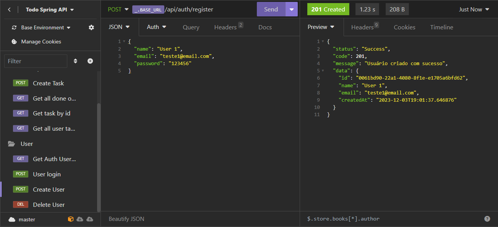
    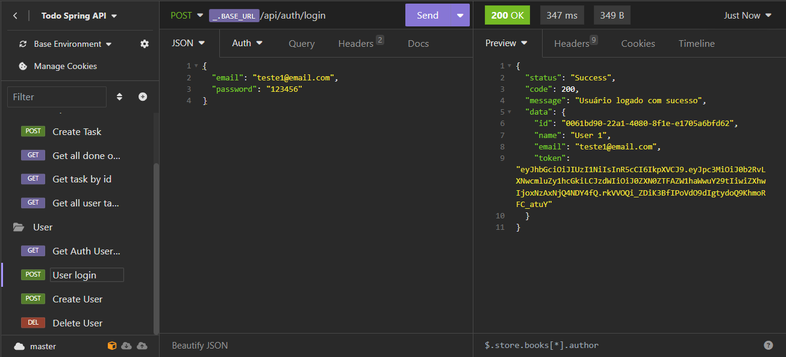
  </details>

<br />

- Ver informações do usuário autenticado.
  <details>
    <summary>Clique aqui para ver a imagem</summary>
    <br />
    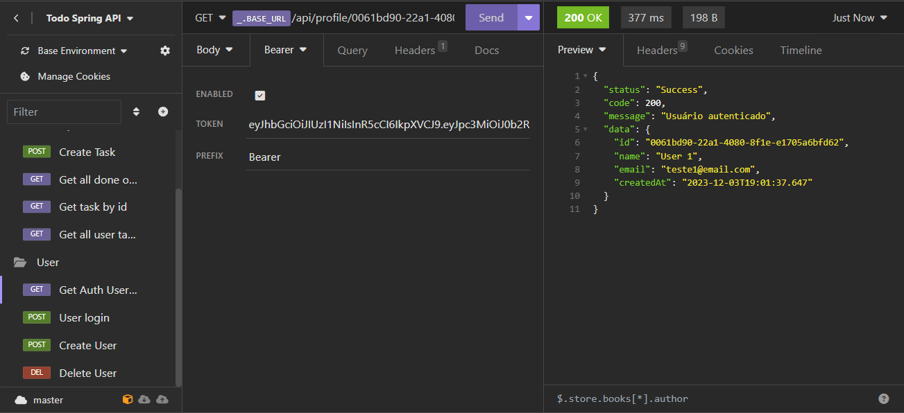
  </details>

<br />

- Excluir usuário e todas suas tarefas.
  <details>
    <summary>Clique aqui para ver a imagem</summary>
    <br />
    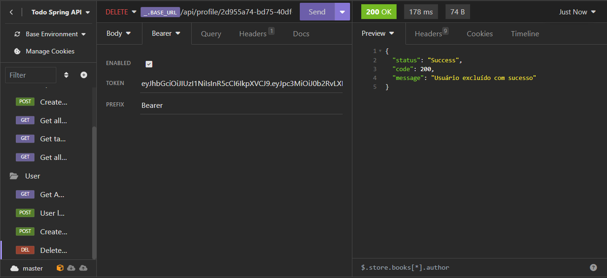
  </details>

<br />

- Criar tarefa.
  <details>
    <summary>Clique aqui para ver a imagem</summary>
    <br />
    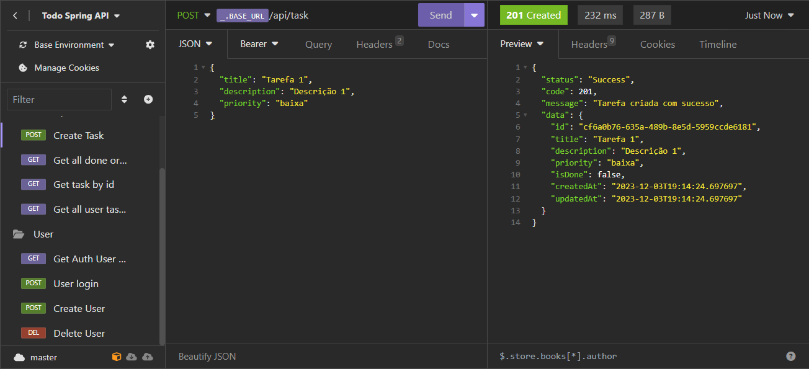
  </details>

<br />

- Atualizar tarefa.
  <details>
    <summary>Clique aqui para ver a imagem</summary>
    <br />
    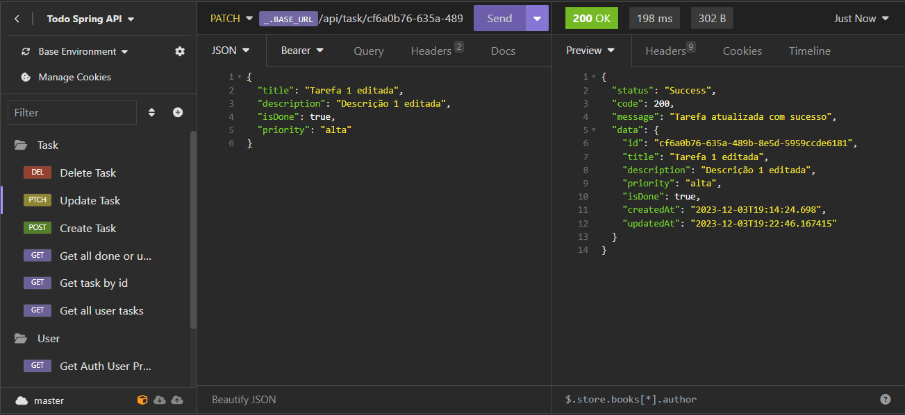
  </details>

<br />

- Excluir tarefa.
  <details>
    <summary>Clique aqui para ver a imagem</summary>
    <br />
    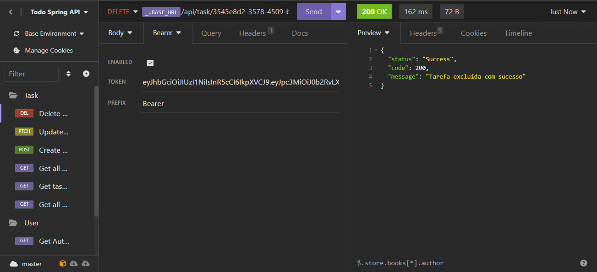
  </details>

<br />

- Listar todas as tarefas do usuário.
  <details>
    <summary>Clique aqui para ver a imagem</summary>
    <br />
    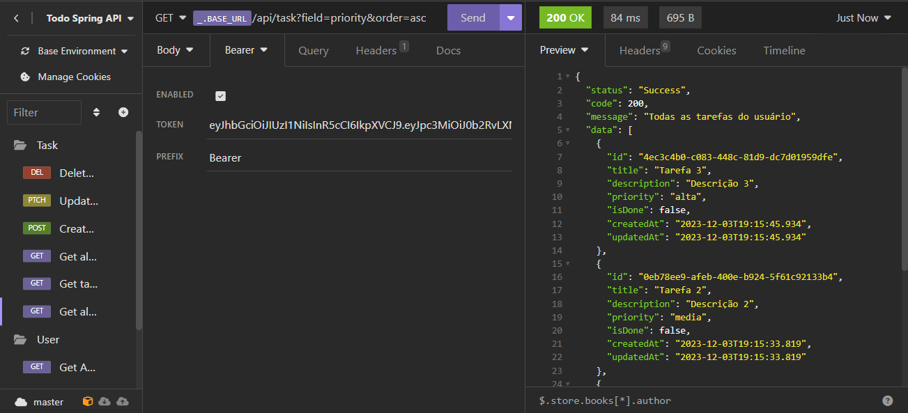
  </details>

<br />

- Ver tarefa específica.
  <details>
    <summary>Clique aqui para ver a imagem</summary>
    <br />
    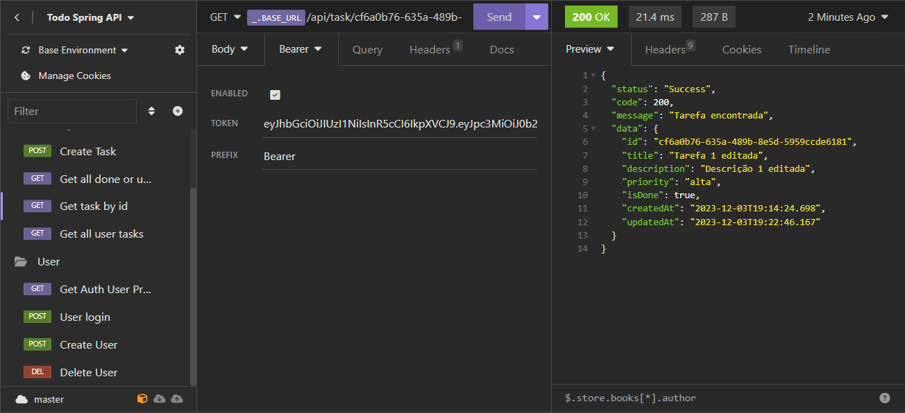
  </details>

<br />

- Listar todas as tarefas marcadas como feitas.
  <details>
    <summary>Clique aqui para ver a imagem</summary>
    <br />
    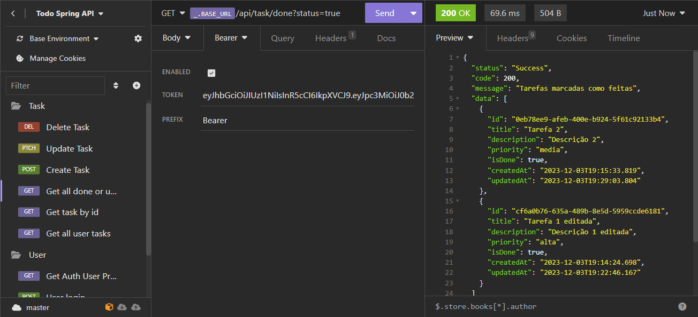
  </details>

<br />

- Algumas das respostas de erro que a API retorna.
  <details>
    <summary>Clique aqui para ver as imagens</summary>
    <br />
    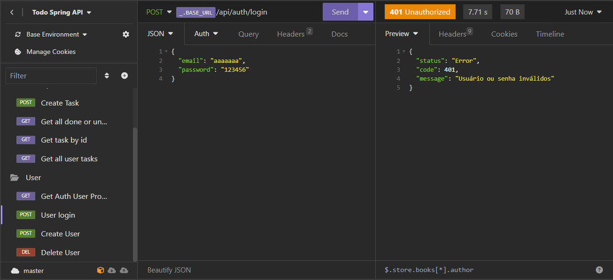
    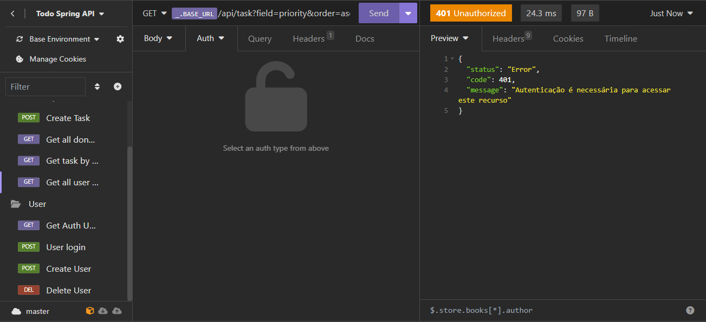
    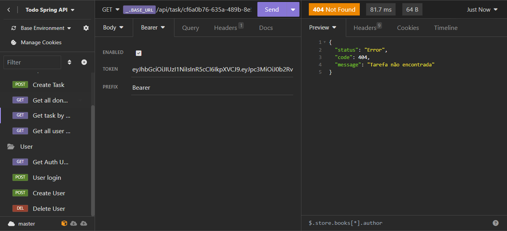
    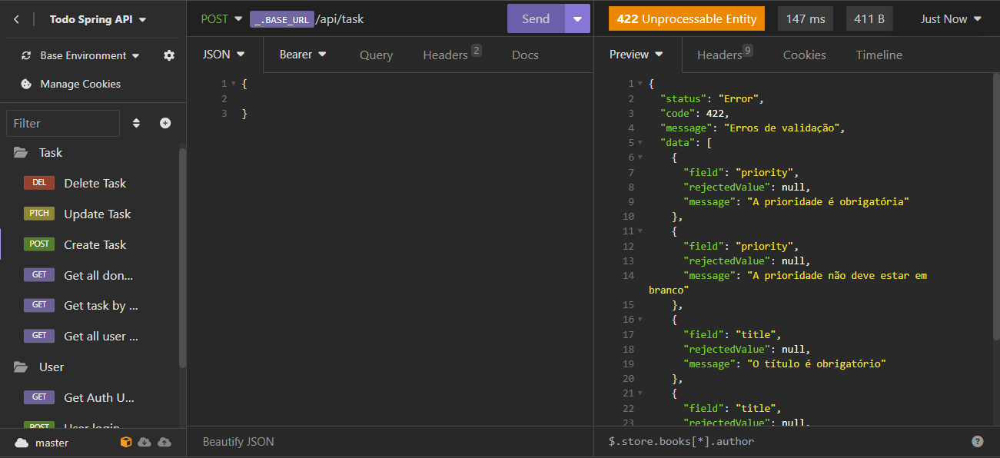
  </details>

<h2 id="technologies">💻 Tecnologias utilizadas</h2>
As ferramentas que foram utilizadas na construção do projeto:

- [Java 17](https://docs.oracle.com/en/java/javase/17)
- [Spring Boot 3 (Spring 6)](https://spring.io/projects/spring-boot#overview)
- [Spring Security 6](https://docs.spring.io/spring-security/reference/index.html)
- [Maven](https://maven.apache.org/)
- [JPA + Hibernate](https://spring.io/projects/spring-data-jpa#overview)
- [PostgreSQL](https://www.postgresql.org/)
- [JUnit5 + Mockito](https://docs.spring.io/spring-framework/reference/testing.html)
- [JWT (JSON Web Token)](https://github.com/auth0/java-jwt)
- [Docker](https://www.docker.com/)

<h2 id="functions">🚀 Funções/Recursos</h2>

Principais recursos e funções da aplicação:

- **Autenticação e Autorização:** Sistema de autenticação stateless com JWT (JSON Web Token) e autorização/proteção das rotas da API feitos com o módulo Spring Security.
- **Camadas:** Divisão da aplicação em 3 camadas principais: `Repository`, `Service` e `Controller`. Fazendo com que as reponsabilidades da aplicação fiquem bem definidas e separadas, melhorando as possibilidades de escalonamento e manutenibilidade.
- **Testes unitários:** Testes unitários das camadas `Repository`, `Service` e `Controller` feitos com o JUnit5 em conjunto com o Mockito.
- **Tratamento de exceções:** Centralização do tratamento de todas as exceções da aplicação em um `Rest Controller Advice`.
- **DTO(Data Transfer Objects):** Utilização de [Java Records](https://docs.oracle.com/en/java/javase/14/language/records.html#GUID-6699E26F-4A9B-4393-A08B-1E47D4B2D263) como DTOs para transferência de dados entre as camadas de `service` e `controller`.
- **Validação:** Validação dos dados das requisições com o Hibernate/Jakarta Validation.
- **Armazenamento:** Armazenamento dos dados em um banco de dados Postgres executando em container Docker.

<h2 id="routes">🧭 Rotas da API</h2>

Rotas de `User`:

| Tipo           | Rota                                      | Ação                                    |
| :------------: | ----------------------------------------- | --------------------------------------- |
| **_`POST`_**   | `/api/auth/login`    | Logar na aplicação .                    |
| **_`POST`_**   | `/api/auth/register` | Criar um novo usuário .                 |
| **_`GET`_**    | `/api/profile/{id}`  | Ver informações do usuário autenticado. |
| **_`DELETE`_** | `/api/profile/{id}`  | Excluir usuário e todas as tarefas.     |

<br />

Rotas de `Task`:

| Tipo                                                                          | Rota                              | Ação             |
| :---------------------------------------------------------------------------: | --------------------------------- | ---------------- |
| **_`POST`_**   | `/api/task`                             | Criar tarefa. |
| **_`GET`_**    | `/api/task?field={field}&order={order}` | Listar todas as tarefas do usuário. As tarefas podem ser filtradas por campo(field) e ordem(order) crescente(`asc`) e decrescente(`desc`). |
| **_`GET`_**    | `/api/task/done?status={status}`        | Listar todas as tarefas marcadas como feitas ou não feitas de acordo com o valor passado no parâmetro `status`. Valores aceitos: `true` ou `false`. |
| **_`GET`_**    | `/api/task/{id}`                        | Ver tarefa específica de acordo com o `id` passado.     |
| **_`PATCH`_**  | `/api/task/{id}`                        | Atualizar tarefa específica de acordo com `id` passado. |
| **_`DELETE`_** | `/api/task/{id}`                        | Deletar tarefa específica de acordo com `id` passado.   |

<h2 id="run">⚙ Como rodar a aplicação</h2>

### Executando o código localmente
-> Para executar o código localmente, é necessário ter instalado o [Git](https://git-scm.com/), o [Java](https://www.oracle.com/br/java/technologies/downloads/#java17) devidamente configurado, e o [Docker](https://www.docker.com/).
- Para executar a aplicação, precisamos rodar alguns comandos com o auxílio de um terminal. Primeiro, clone este repositório:

  ```bash
  $ git clone https://github.com/luizfelipeapolonio/todo-spring-api
  ```
- Acesse a pasta da aplicação:
  ```bash
  $ cd todo-spring-api
  ```
- Crie e inicialize o container Docker do banco de dados da aplicação:
  > ⚠ O Docker já deve estar executando antes de rodar este comando.
  ```bash
  $ docker compose -f docker-compose-local.yml up -d
  ```
- Assumindo que o container Docker do banco de dados Postgres esteja rodando localmente, altere o arquivo `application.properties` da seguinte maneira:
  ```bash
  # Acesse a pasta onde se encontra o arquivo:
  src/main/resources

  # Em um editor de código, altere a linha do arquivo application.properties para:
  spring.datasource.url=jdbc:postgresql://localhost:5432/todo_spring_api
  ```

<br />

  > ⚠ Se estiver utilizando Windows, use o `PowerShell` para executar todos os comandos abaixo para que funcionem como esperado.
- Na raíz da pasta `todo-spring-api`, execute o script do Maven Wrapper para instalar as dependências:
  ```bash
  $ ./mvnw clean install
  ```
- Execute a aplicação como uma aplicação Spring Boot:
  ```bash
  $ ./mvnw spring-boot:run
  ```
  ou abra a aplicação na sua IDE favorita como um projeto Maven e execute como uma aplicação Spring Boot.

- A aplicação ficará acessível no endereço http://localhost:8080

### Executando a aplicação no Docker

-> Para executar a aplicação e o banco de dados em containers basta ter instalado o [Docker](https://www.docker.com/) e o [Git](https://git-scm.com/).
- Primeiro, clone este repositório:

  ```bash
  $ git clone https://github.com/luizfelipeapolonio/todo-spring-api
  ```
- Acesse a pasta da aplicação:
  ```bash
  $ cd todo-spring-api
  ```
- Gere a imagem Docker da aplicação com o comando:
  > ⚠ O " . " no final do comando é essencial para a execução, portanto, certifique-se de que o comando esteja exatamente igual a este.
  ```bash
  $ docker build -t todo_spring_image .
  ```
- Uma vez gerada a imagem, crie e inicialize os containers da aplicação e do banco de dados com o comando:
  ```bash
  $ docker compose up -d
  ```
- Ambos containers serão construídos e inicializados. A aplicação estará acessível no endereço http://localhost:8080

<h2 id="license">📝 Licença</h2>

Este repositório está licenciado pela **MIT LICENSE**. Para mais informações, leia o arquivo [LICENSE](./LICENSE) contido neste repositório.

<h2 id="author">Autor</h2>

Linkedin: [acesse meu perfil](https://www.linkedin.com/in/luiz-felipe-salgado-31a969273/).

Feito com 💜 por luizfelipeapolonio
